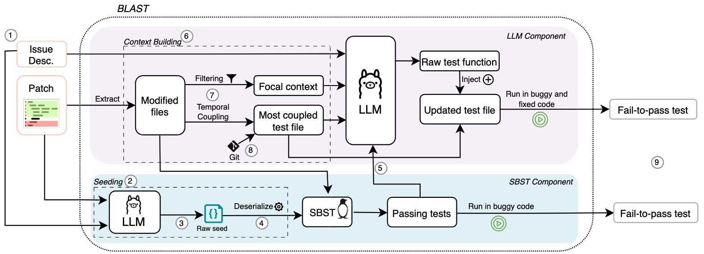

# Automated Generation of Issue-Reproducing Tests by Combining LLMs and Search-Based Testing

This repository contains the code for the paper  
[**Automated Generation of Issue-Reproducing Tests by Combining LLMs and Search-Based Testing**](https://arxiv.org/pdf/2509.01616)  
accepted to ASE '25.

<p align="center">
  
</p>


## Table of Contents
- [Setup](#setup)
- [Running BLAST](#running-blast)
- [Running the Baselines (RQ1)](#running-the-baselines)
- [Ablations (RQ2)](#placeholder-section-2)
  - [Table I](#table-i)
  - [Table II](#table-ii)
  - [Table III](#table-iii)
- [Trivial Instances of SWTBench/TDDBench](#trivial-instances-of-swtbenchtddbench)
- [Manual Analysis of Failures](#manual-analysis-of-failures)
- [In-Vivo Evaluation with Mozilla (RQ3)](#in-vivo-evaluation-with-mozilla)


## Setup
This repository is tested and recommended on Ubuntu 22.04 and macOS (15.6 or newer) with Python 3.12. Docker is required because the tests are ran in an isolated Docker environment, so ensure the daemon is running before proceeding.

Start by installing the following:
```sh
sudo apt update
sudo apt install -y python3.12-dev build-essential git pkg-config
```

Create a Python 3.12 virtual environment and install the required packages:
```sh
python3.12 -m venv .venv
source .venv/bin/activate

pip install -r requirements.txt
```

This repo also uses LLMs, specifically gpt-4o that requires an OpenAI key (default) and llama/deepseek that require a Groq key. You can set your keys like this:
```sh
export OPENAI_API_KEY="sk-XXXX"   # required
export GROQ_API_KEY="gsk-YYYY"    # optional (for ablation studies with LLaMA/DeepSeek)
```

A less secure but more convenient alternative is to save the keys in `keys.json`. Currently, the code will first search in the environment variables and if the key is not found there, it will search in `keys.json`.

## Running BLAST
BLAST is implemented end-to-end in the script `./run_blast.sh`, which also contains information about the available CLI options. Make the script executable by running:

```sh
chmod +x run_blast.sh
```

Then run BLAST:

```sh
./run_blast.sh <mylabel>
```

For *debug mode* (e.g., quick start, local development), use: `sh ./run_blast.sh <mylabel> 1`. To run the LLM component or the SBST component separately, see [Ablations](#ablations).


## Running the Baselines
To run the two baselines of Table 1, i.e., *ZeroShot* and *AutoTDD*, follow the instructions of `baselines/README.md`.


## Ablations

The script `run_blast.sh` is customizable to allow for easy ablation studies, like the ones reported in the paper and more.

### Table I
To run BLAST with models other than the default gpt-4o, simply add the flag `--model llama-3.3-70b-versatile` or `--model deepseek-r1-distill-llama-70b` to the first two scripts of `run_blast.sh`.

#### Table II
To run only the LLM component of BLAST, simply comment out the first step of `run_blast.sh`.

The input combinations C1-C7 of Table II can be reproduced by switching the boolean inputs of the `build_prompt()` function in `run_llm_component.py`. For example, to reproduce the combination C1, we set `include_issue_description=True` and `include_predicted_test_file=True` with the rest of the parameters being set to `False`.

#### Table III
To run only the SBST component of BLAST, simply comment out steps 2 and 3 of `run_blast.sh`. You can vary the time budget using the cli argument `--budget_seconds 6` of `run_sbst_component.py`.

This will run Pynguin on the `PyngBench` dataset that we introduced in *Section V.B (Pynguin-Compatible Dataset)*, and which contains the 113 instances defined in `pyngbench_ids.txt`. These instances were obtained by running the `run_sbst_component.py` on all instances (e.g., by removing the filtering in line 387) and keeping only the instances were Pynguin ran successfully. The `run_sbst_component.py` can be used for further experimentation towards applying Pynguin to issue-reproducing test generation.

## Trivial Instances of SWTBench/TDDBench

In Section *V.B (Data Cleaning)* of our paper, we manually analyzed instances of TDDBench/SWTBench to check if they are trivial for the test generation task, like in Fig. 5. We performed this manual step since TDDBench and SWTBench are adaptations of SWEBench, which is a benchmark designed for patch generation and not test generation.

Our analysis revealed 23 instances where the test is included in the issue description, which we marked as *trivial* and did not use them in our analysis. The instance IDs can be found in `trivial_ids.txt` and the corresponding PR urls are available by expanding the list below. Each PR is linked to an issue, which contains the code to reproduce the issue.

<details>
  <summary>Click to expand PR URLs</summary>

- [django/django#16032](https://github.com/django/django/pull/16032)  
- [django/django#15280](https://github.com/django/django/pull/15280)  
- [django/django#15128](https://github.com/django/django/pull/15128)  
- [django/django#15503](https://github.com/django/django/pull/15503)  
- [django/django#13964](https://github.com/django/django/pull/13964)  
- [django/django#11734](https://github.com/django/django/pull/11734)  
- [django/django#14034](https://github.com/django/django/pull/14034)  
- [django/django#16661](https://github.com/django/django/pull/16661)  
- [django/django#11532](https://github.com/django/django/pull/11532)  
- [django/django#11265](https://github.com/django/django/pull/11265)  
- [django/django#12663](https://github.com/django/django/pull/12663)  
- [django/django#15315](https://github.com/django/django/pull/15315)  
- [django/django#11964](https://github.com/django/django/pull/11964)  
- [django/django#15104](https://github.com/django/django/pull/15104)
- [django/django#12273](https://github.com/django/django/pull/12273)  
- [matplotlib/matplotlib#23299](https://github.com/matplotlib/matplotlib/pull/23299)  
- [pytest-dev/pytest#5262](https://github.com/pytest-dev/pytest/pull/5262)
- [pytest-dev/pytest#7432](https://github.com/pytest-dev/pytest/pull/7432)  
- [pytest-dev/pytest#7205](https://github.com/pytest-dev/pytest/pull/7205)  
- [pytest-dev/pytest#7521](https://github.com/pytest-dev/pytest/pull/7521)  
- [pytest-dev/pytest#10051](https://github.com/pytest-dev/pytest/pull/10051)
- [scikit-learn/scikit-learn#13142](https://github.com/scikit-learn/scikit-learn/pull/13142)  
- [sympy/sympy#23824](https://github.com/sympy/sympy/pull/23824)  


</details>

## Manual Analysis of Failures
In *Section VI.C (Analysis of Failure Cases)*, we perform a card sorting of cases were BLAST failed to generate a fail-to-pass test, on an attempt to better understand BLAST's limitations. The rationale behind the card sorting can be found in `manual_sorting_of_failures.xlsx`.


## In-Vivo Evaluation with Mozilla
In *Section VII*, we evaluated BLAST by deploying it in 3 open-source repositories of Mozilla. The source code of the bot that runs BLAST whenever a new PR is opened can be found under `github_bot/`, along with instructions to install the bot to listen to your own repository.

The feedback we received from the developers for the 11 fail-to-pass tests generated by BLAST can be found in `github_bot/Developer Feedback.xlsx`, where the first column also contains the PR link where the test was proposed.

## Citation

```
@inproceedings{blast2025,
  title     = {Automated Generation of Issue-Reproducing Tests by Combining LLMs and Search-Based Testing},
  author    = {Konstantinos Kitsios and Marco Castelluccio and Alberto Bacchelli},
  booktitle = {Proceedings of the 40th IEEE/ACM International Conference on Automated Software Engineering (ASE)},
  year      = {2025},
  note      = {to appear}
}
```
